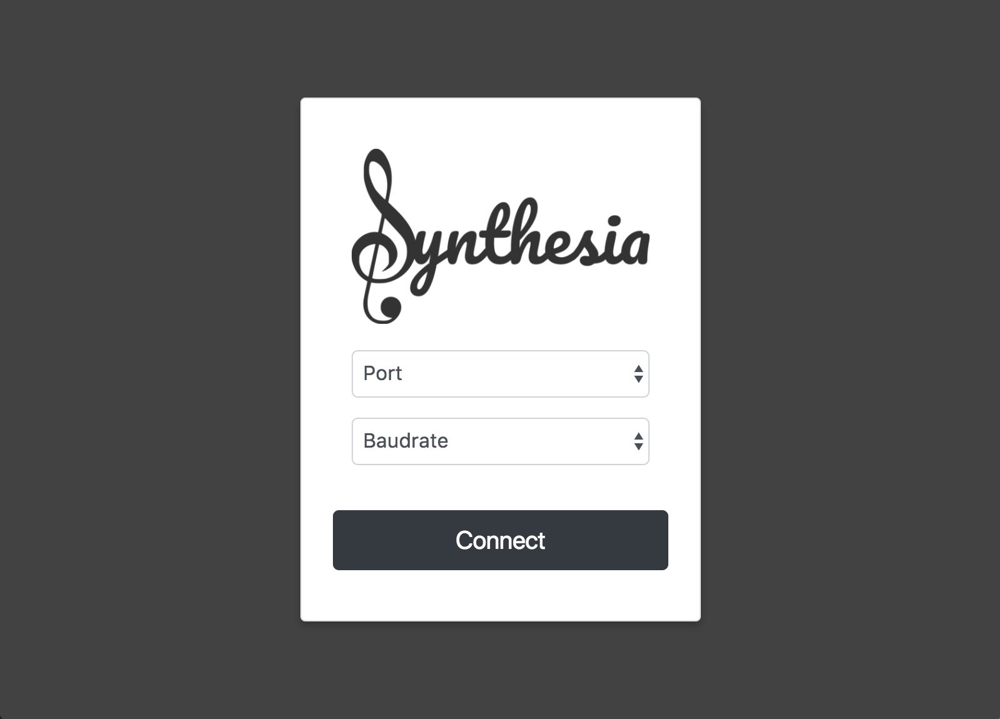
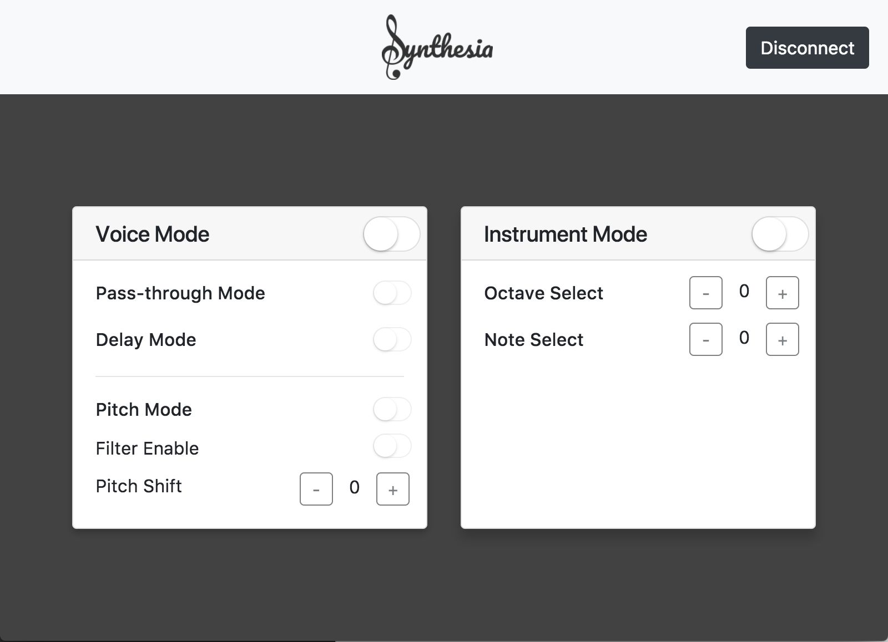

# Synthesia
A audio synthesizer implemented on a Basys3 FPGA board and written in Verilog.

For the full report, please look in the pdf document of the repository.

## Introduction
This README outlines the feature-set of my EE2020 final project. In this project, we were required to implement an audio synthesizer with a certain compulsory feature set. 

My final product, Synthesia, provides a whole range of features along with the ability of control over a custom coded app. In the following sections, I will be outlining the full feature set of my project and explaining a few of the implementation methods.

## Features
The core of my implementation can be divided into 2 main subunits. The first subunit covers real-time audio manipulation which uses the attached MIC unit as an audio source. In contrast, in the second subunit, the FPGA itself is the audio source and serves the purpose of an audio synthesizer.  We will first look at the feature set of the first subunit.

* Audio pass through Mode (Audio from MIC is set to DAC)
* Fixed length delay (Audio from MIC is sent to DAC with a one second delay)
* Pitch shifter (Pitch shifts input audio up or down)

The second subunit allows for the user of the product to generate wave patterns of piano note frequencies (ie C,D,E,F,G). It also allows for several configuration options which can be said to be “features”. These configuration options are shown below.

* Octave shift (Shifts octave of notes up or down)
* Note select (Allows user to select which key is pressed)

The last feature we will be covering is the serial receiver feature. This feature allows the user to configure the outputs of the synthesizer through a serial interface with a computer. This serial interface is utilized by my application to convert the users input to a serialized instruction format before sending it to the FPGA to set its output. The features of that serial interface are outlined below.

* Serial decoder module (Decodes UART signals through the onboard USB-UART converter)
* Serial instruction decoder (Decodes obtained 1 byte input for configuration)

Lastly, a unique feature of this product is that it comes with an application that can interface with this serial communication mechanism. The features of the application are outlined below.

* Built with Electron for cross platform support
* Built with HTML, CSS and Javascript
* Based on Node.js and npm modules
* Uses serialport.js for interface support

## Screenshots of application

